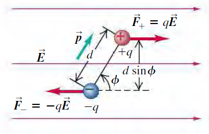
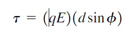
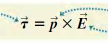
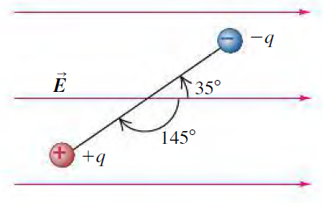

# Electic Charge and Electric Field

## Electric Field Lines

**Electric Field Lines** are imagninary curves on a region of space whose tangent at a point gives direction of electric field vector at that point.

* **Michael Fareday** called them lines of force.
* Field lines never intercsect
* Their spacing refers to the magnitude
* In a uniform electric field, the field lines are parallel and uniformely spaced.
* The trajectory of a particle is not same as the field line.

```
Suppose the electric field lines in a region of space are straight lines. If a charged particle is released from rest in that region, will the trajectory of the particle be along a field line?
```
```
The trejectory will be the same as a freely falling particle, like along the straight lines accelerating based on it's charge.
```

## Electric Dipoles

A pair of point charges with opposite sign but same magnitude ```q``` seperated by a small distance ```d``` is called an electric dipole.

### Force and torque on an electric dipole



* The net force on an electric dipole in a uniform external electric field is zero.
* But the net torque is not zero since, these two forces are a couple



but dipole moment
```
p=qd
```



* So, torque is zero when the the diple and field are parallel.
* It is maximum when both are perpendicular to each other.

### Potential Energy of The Dipole

U = -**p**.**E**

It is derived by taking dW = (torque) dA



Figure 21.32a shows an electric dipole in a uniform electric field of magnitude 5.0 x10<sup>5</sup> N/C that is directed parallel to the plane of
the figure. The charges are **e** both lie in the plane
and are separated by 0.125 nm. 

Find (a) the net force exerted by the field on the dipole; (b) the magnitude and direction of the electric dipole moment; (c) the magnitude and
direction of the torque; (d) the potential energy of the system in the position shown.

```
a) The net force is zero for a dipole in uniform electric field.
b) p=qd=1.6e-19*0.125e-9=2e-29 Cm
c) 

T = pxE => it's clock-wise
T = pEsinA = 2e-29*5e5*sin(145*pi/180)=5.735764363510464e-24
d)

U=-p.E=-pEcosA=-2e-29*5e5*cos(145*pi/180)=8.191520442889915e-24
```

### Field on an electric dipole

